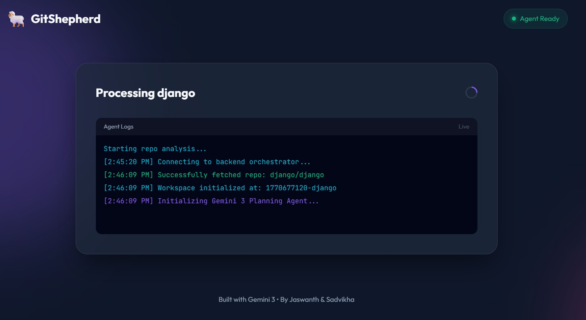
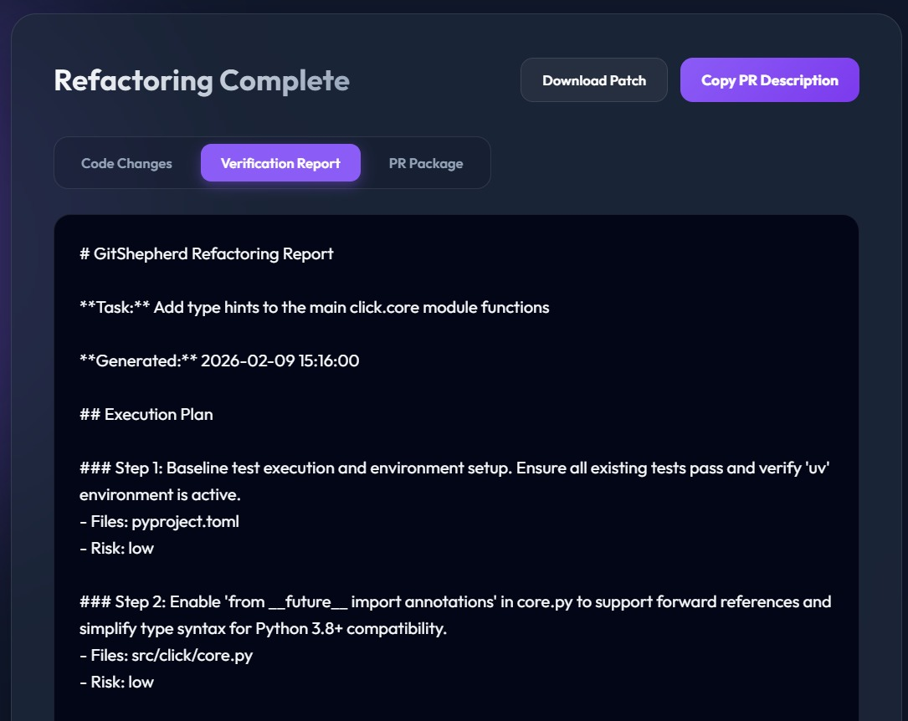
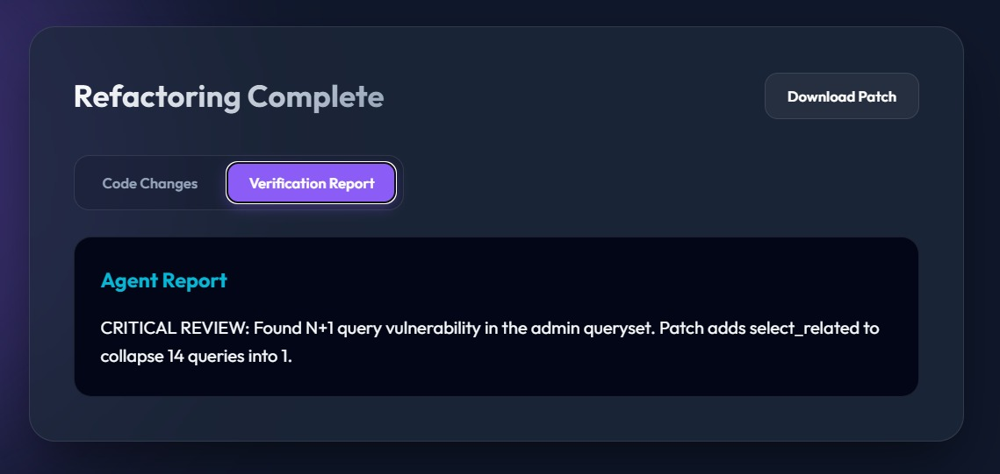

# GitShepherd

**Autonomous AI refactoring agent that transforms natural language tasks into PR-ready code changes—powered by Gemini AI.**

GitShepherd is a smart, self-improving agent that helps open-source contributors and maintainers save massive amounts of time on routine code improvement tasks. Powered by Gemini 3's 1M+ token context window.

## Features

- **Repo Fetcher:** Pulls public repositories via tarball/API for fast analysis.
- **Autonomous Planner:** Creates multi-level refactoring plans based on natural language tasks.
- **Verification Loop:** Runs tests (pytest, etc.) in a loop to ensure correctness.
- **PR Packager:** Generates ready-to-use PR descriptions and unified patches.

## Tech Stack

- **Frontend:** Vanilla HTML/JS with Glassmorphism CSS.
- **Backend:** Python / FastAPI.
- **Intelligence:** Gemini 2.5/3 (Auto-detects available models).
- **Test Runner:** Docker (optional) or local execution.

## Getting Started

1.  **Install dependencies:**
    ```bash
    cd backend
    pip install -r requirements.txt
    ```

2.  **Set up environment:**
    ```bash
    # Create .env file with:
    GEMINI_API_KEY=your_api_key_here
    ```

3.  **Start the backend:**
    ```bash
    python main.py
    ```

4.  **Open the frontend:**
    Open `frontend/index.html` in your browser.

## How it Works

GitShepherd operates on a sophisticated **ReAct (Reasoning + Acting)** loop designed for high-context code manipulation:

### 1. Repo Mapper (Call 0)
The agent performs a "deep scan" of your repository. It doesn't just read code; it analyzes the directory tree to identify the tech stack, locate the main source entries, and determine the exact test commands (e.g., `pytest`, `npm test`) needed for verification.



### 2. Architect Planner (Call 1)
Given your natural language task, the agent uses Gemini's reasoning capabilities to break down the request into an ordered sequence of technical steps. Each step includes the target files, the nature of the change, and a risk assessment.

### 3. Execution and Correction Loop
This is where the agent performs the technical implementation:
- **Writes a Patch:** Generates a unified diff for the specific task.
- **Runs Verification:** Executes the project's test suite to verify the change.
- **Self-Corrects:** If tests fail, the agent analyzes the logs, diagnoses the root cause, and tries a different approach until the code is stable.

### 4. PR Package (Final)
Once the task is verified, the agent aggregates all changes into a final Verification Report and a conversational PR description ready to be used on GitHub.



### PR Review Mode
GitShepherd can also be used to critique existing Pull Requests. It analyzes the proposed changes for security risks, performance bottlenecks, and logical errors.



